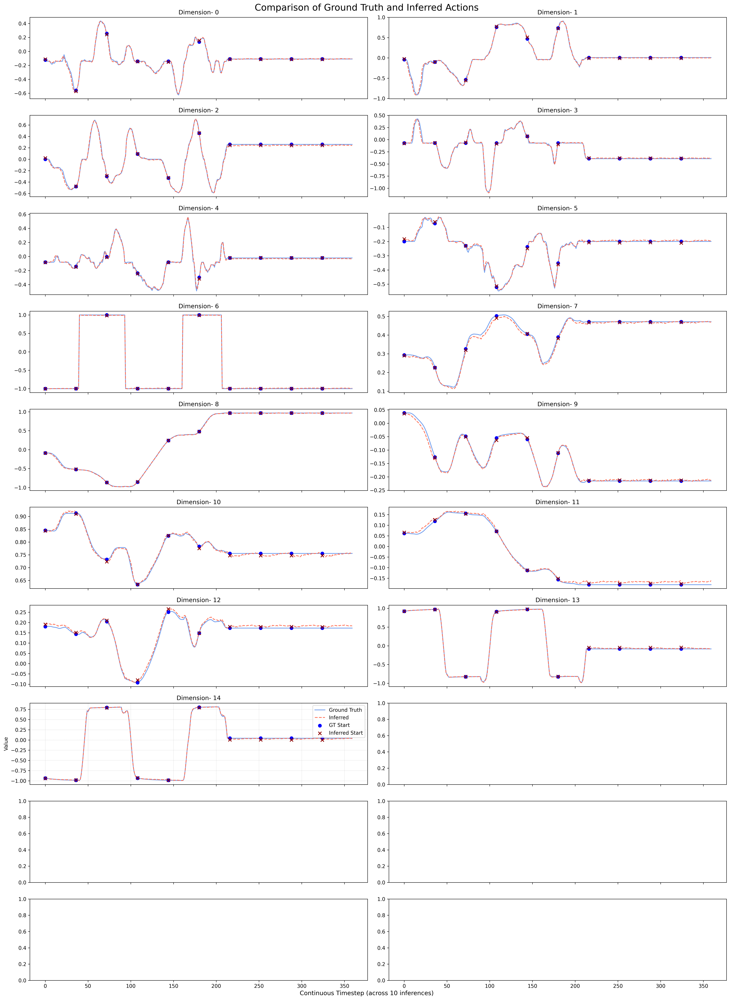

# Genie Envisioner：面向机器人操作的统一世界基础平台

## GE-Act 在仿真基准上的性能

### CALVIN

| 划分 | 长度 1 | 长度 2 | 长度 3 | 长度 4 | 长度 5 | 平均完成子任务数 |
| --- | ---: | ---: | ---: | ---: | ---: | ---: |
| 成功率 | 0.950 | 0.898 | 0.857 | 0.808 | 0.747 | 4.260 |

## 在 CALVIN 上评估

1. 从 [ModelScope](https://modelscope.cn/models/agibot_world/Genie-Envisioner/files)
   下载使用 CALVIN 数据集训练的 GE-Act 权重。

2. 修改 `experiments/eval_calvin.sh` 中的 checkpoint 路径。

3. 修改 `configs/ltx_model/calvin/action_model_calvin.yaml` 中的
   `pretrained_model_name_or_path`。

4. 执行：

   ```bash
   bash experiments/eval_calvin.sh
   ```

### LIBERO

| 划分 | Goal | Object | LIBERO-10 | Spatial | 平均值 |
| --- | ---: | ---: | ---: | ---: | ---: |
| 成功率 | 0.958 | 0.976 | 0.944 | 0.982 | 0.965 |

## 在 LIBERO 上评估

1. 从 [ModelScope](https://modelscope.cn/models/agibot_world/Genie-Envisioner/files)
   下载使用 LIBERO 数据集训练的 GE-Act 权重。

2. 修改 `experiments/eval_libero.sh` 中的 checkpoint 路径。

3. 修改 `configs/ltx_model/libero/action_model_libero.yaml` 中的
   `pretrained_model_name_or_path`。

4. 执行：

   ```bash
   bash experiments/eval_libero.sh
   ```

## 在 LIBERO 上训练

### 准备数据集

1. 下载 [LIBERO RLDS 数据集](https://huggingface.co/datasets/openvla/modified_libero_rlds)。

2. 参考 OpenPI 的
   [LIBERO 转换脚本](https://github.com/Physical-Intelligence/openpi/blob/main/examples/libero/convert_libero_data_to_lerobot.py)，
   将 LIBERO 数据集转换为 LeRobot 格式。

### 准备动作和状态统计量

1. 可以直接使用 `configs/ltx_model/libero/libero_all.json` 中提供的统计文件。

2. 如果需要基于自己的数据重新生成统计文件，执行：

   ```bash
   python scripts/get_statistics.py \
     --data_root PATH/TO/YOUR/DATASET \
     --data_name libero \
     --data_type eef \
     --action_key actions \
     --state_key state \
     --save_path PATH/OF/FILE.json
   ```

### 面向任务的视频适配

1. 修改 `configs/ltx_model/libero/video_model_libero.yaml` 中的数据、模型和输出路径。

2. 执行：

   ```bash
   bash scripts/train.sh main.py configs/ltx_model/libero/video_model_libero.yaml
   ```

### Action Post-Training

1. 修改 `configs/ltx_model/libero/action_model_libero.yaml` 中的数据、模型和输出路径。

2. 执行：

   ```bash
   bash scripts/train.sh main.py configs/ltx_model/libero/action_model_libero.yaml
   ```

3. 训练完成后，模型应该能在 open-loop 验证图中较好地拟合训练数据。下图展示了
   GE-Act 在 LIBERO-10 上训练 50,000 step、总 batch size 为 128 时的 open-loop
   精度示例。



## AWM-CoCA 训练

AWM-CoCA 默认使用 fresh on-policy LoRA 训练，正式训练的全局 `group_size=16`。
当前奖励为严格的 50% Action reward 加 50% 三视角 PSNR geometry reward。

迁移到新机器后，先执行不加载大模型的预检查：

```bash
CUDA_VISIBLE_DEVICES=0 scripts/run_awm_coca.sh preflight \
  --prep-root /data/awm/prep \
  --gt-root /data/awm/selected_samples/samples \
  --checkpoint-root /models/genie-envisioner \
  --output-dir /output/awm_coca
```

单卡 smoke 会自动使用 `group_size=2`，只跑一个 condition 和一个 optimizer step：

```bash
CUDA_VISIBLE_DEVICES=0 scripts/run_awm_coca.sh smoke \
  --prep-root /data/awm/prep \
  --gt-root /data/awm/selected_samples/samples \
  --checkpoint-root /models/genie-envisioner
```

四张 A100 上首次建议先跑一个 optimizer step：

```bash
CUDA_VISIBLE_DEVICES=0,1,2,3 scripts/run_awm_coca.sh train4 \
  --max-optimizer-steps 1 \
  --dataset-limit 1 \
  --keep-consumed-rollouts
```

确认无误后启动正式四卡训练：

```bash
CUDA_VISIBLE_DEVICES=0,1,2,3 scripts/run_awm_coca.sh train4
```

奖励、CoCA credit、可调参数、目录结构和 checkpoint 恢复方式详见
[AWM-CoCA 中文说明](./awm_coca/README.md)。远端环境、模型下载、四卡训练和结果回传见
[远端训练交付说明](../TRAINING_REMOTE_README.md)。
